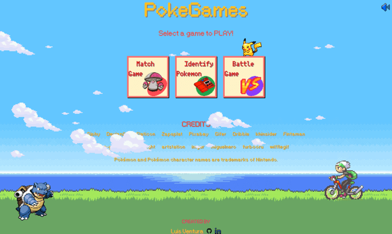
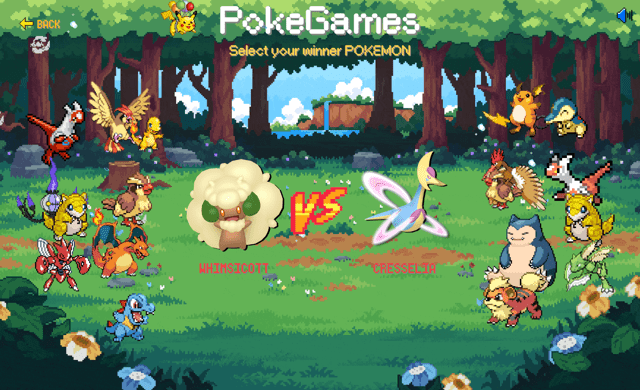
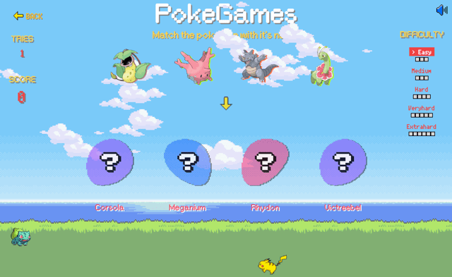
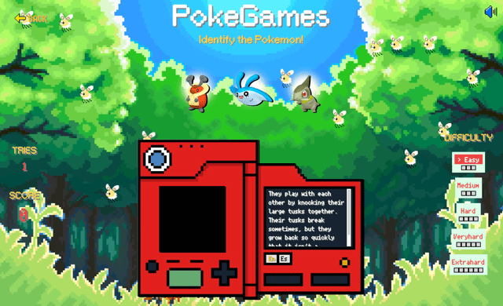

# PokeGames

PokeGames is a Vue.js + Vite application that offers a collection of mini-games inspired by the popular Pokemon franchise. Players can enjoy various exciting challenges and activities featuring their favorite Pokemon characters.

<p align="center">
  
</p>

## Table of Contents

- [Features](#features)
- [Installation](#installation)
- [Usage](#usage)
- [Contributing](#contributing)
- [Credits](#credits)
- [License](#license)

## Features

Based on the provided images, the PokeGames application includes the following features:

1. **Select Your Winner Pokemon**
- Players can choose between two Pokemon to engage in a battle.
<p align="center">
  
</p>

2. **Match Pokemon Name Game**
- Players are presented with a set of Pokemon sprites and must match them with their corresponding names.
<p align="center">
  
</p>

3. **Identify Pokemon Game**
- Players are challenged to identify a Pokemon based on a provided description.
<p align="center">
  
</p>

## Installation

To install and run the PokeGames application locally, follow these steps:

1. Clone the repository:
```sh
git clone https://github.com/your-username/pokegames.git
```
2. Navigate to the project directory:
```sh
cd pokegames
```
3. Install the dependencies:
```sh
npm install
```
4. Start the development server:
```sh
npm run dev
```
5. Open your web browser and visit `http://localhost:5173` to access the PokeGames application.

## Usage

Once the application is running, you will be presented with the main menu. Click on the desired mini-game icon to start playing.

Each mini-game will have its own instructions and gameplay mechanics. Follow the on-screen prompts and enjoy the Pokemon-themed challenges!

## Contributing

Contributions to the PokeGames project are welcome! If you encounter any issues or have suggestions for improvements, please open an issue on the GitHub repository.

If you'd like to contribute code changes, follow these steps:

1. Fork the repository
2. Create a new branch for your feature or bug fix
3. Make your changes and commit them
4. Push your changes to your forked repository
5. Submit a pull request detailing your changes

## Credits
#### Art, music, resources:

- Giphy
- DevianArt
- Flaticon
- Zapsplat
- Pixabay
- Gifer
- Dribble
- khinsider
- Fintaman
- rare-gallery
- @WndlIght
- artstation
- imgur
- miguelnero
- furbooru
- wifflegif
- Nintendo


## License

This project is licensed under the [MIT License](LICENSE).

Please note that the Pokemon and Pokemon character names are trademarks of Nintendo, as mentioned in the credits screen.

